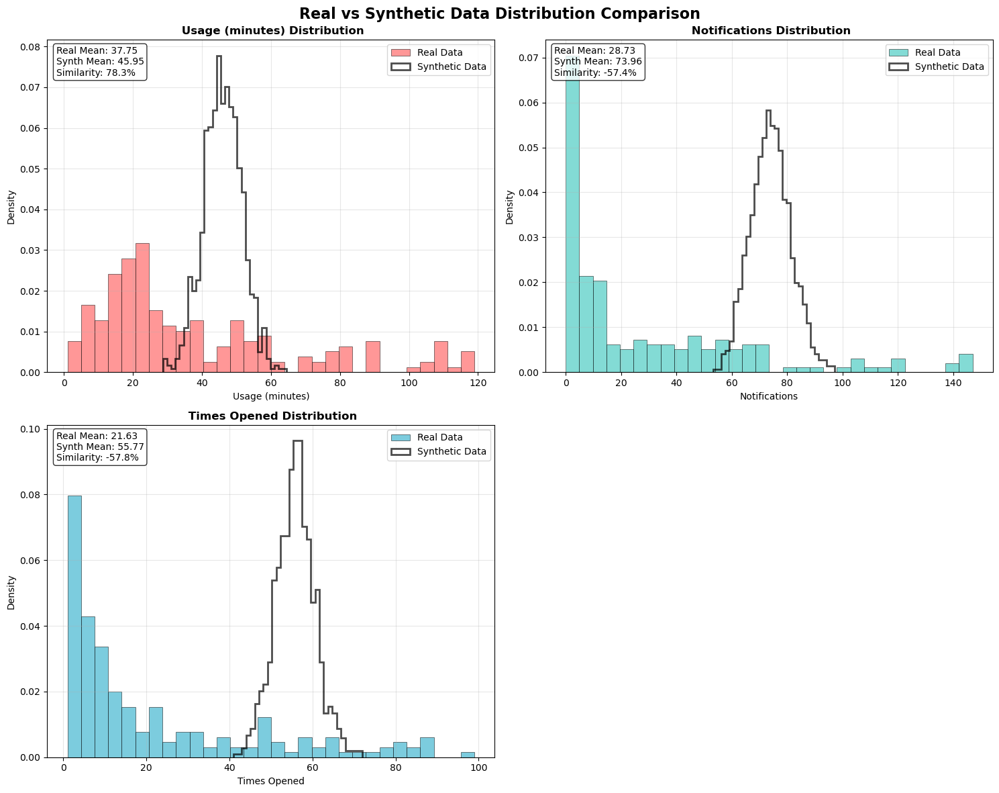

# 🎯 Synthetic Data Generation using GANs


> **Generate realistic synthetic screen time data using Generative Adversarial Networks (GANs) for privacy-preserving analytics and data augmentation.**

## 🚀 Project Overview

This project implements a **Generative Adversarial Network (GAN)** to generate synthetic screen time data that mimics real user behavior patterns. The model learns from actual screen time data to create realistic synthetic datasets that can be used for research, testing, and analytics without compromising user privacy.

<p align="center">
  <br>
  <em>Real Data vs Synthetic Data Plot (For all 3 Features)</em>
</p>


### 🎯 Key Features

- **🔒 Privacy-Preserving**: Generate synthetic data instead of sharing sensitive user information
- **📊 High-Quality Output**: Maintains statistical properties and correlations of original data
- **🎨 Deep Learning**: Implements state-of-the-art GAN architecture with TensorFlow/Keras
- **📈 Data Augmentation**: Expand limited datasets for machine learning applications
- **📊 Comprehensive Visualizations**: Distribution comparisons, correlation analysis, and quality metrics
- **💾 Data Export**: Automated CSV export with timestamp-based file organization
- **🔍 Quality Validation**: Statistical comparison and visual validation tools
- **🧪 Research-Ready**: Perfect for academic research and commercial applications

## 📋 Dataset

The project uses screen time analysis data with the following features:
- **📱 Usage (minutes)**: Daily screen time duration
- **🔔 Notifications**: Number of notifications received
- **📲 Times Opened**: Frequency of app interactions

## 🏗️ Architecture

### Generator Network
```
Random Noise (100D) → Dense(128) → Dense(256) → Dense(512) → Dense(3) → Synthetic Data
                       ↓ LeakyReLU  ↓ LeakyReLU  ↓ LeakyReLU   ↓ Sigmoid
                       ↓ BatchNorm  ↓ BatchNorm  ↓ BatchNorm
```

### Discriminator Network
```
Screen Time Data (3D) → Dense(512) → Dense(256) → Dense(128) → Dense(1) → Real/Fake
                        ↓ LeakyReLU  ↓ LeakyReLU  ↓ LeakyReLU   ↓ Sigmoid
```

## 🛠️ Installation

### Prerequisites
- Python 3.8+
- pip or conda package manager

### Setup Instructions

1. **Clone the repository**
   ```bash
   git clone https://github.com/Mehardeep79/Synthetic-Data-Generation-GAN.git
   cd synthetic-data-generation-gan
   ```

2. **Install dependencies**
   ```bash
   pip install -r requirements.txt
   ```

3. **Launch Jupyter Notebook**
   ```bash
   jupyter notebook synthetic_data_gan.ipynb
   ```

### Required Packages
```
tensorflow>=2.10.0
numpy>=1.21.0
pandas>=1.3.0
scikit-learn>=1.0.0
matplotlib>=3.5.0
seaborn>=0.11.0
scipy>=1.7.0
jupyter>=1.0.0
```

## 🚀 Quick Start

1. **Load your data**: Place your screen time CSV file in the project directory
2. **Run preprocessing**: Execute data cleaning and normalization cells
3. **Train the GAN**: Run the training loop (10,000 epochs recommended)
4. **Generate synthetic data**: Use the trained generator to create new samples
5. **Visualize results**: Run comprehensive data quality analysis
6. **Export data**: Save synthetic data to CSV for external use

```python
# Quick example
from tensorflow.keras.models import load_model
import numpy as np
import pandas as pd

# Load trained generator
generator = load_model('trained_generator.h5')

# Generate 1000 synthetic samples
noise = np.random.normal(0, 1, (1000, 100))
synthetic_data = generator.predict(noise)

# Save to CSV
synthetic_df = pd.DataFrame(synthetic_data, columns=['Usage', 'Notifications', 'Times Opened'])
synthetic_df.to_csv('outputs/my_synthetic_data.csv', index=False)
```

## 📊 Results & Visualizations

### Training Progress
- **Epochs**: 10,000 training iterations
- **Batch Size**: 128 samples per batch
- **Loss Monitoring**: Real-time discriminator and generator loss tracking

### Generated Data Quality
- **Statistical Similarity**: Preserves mean, variance, and distribution of original data
- **Feature Correlations**: Maintains relationships between usage patterns and notifications
- **Realistic Ranges**: Generated values fall within expected bounds for screen time metrics

### 📈 Comprehensive Analysis Features

#### **Distribution Comparison Plots**
- Side-by-side histograms comparing real vs synthetic data distributions
- Statistical similarity metrics with percentage preservation scores
- Visual validation of data quality across all features

#### **Correlation Analysis**
- Heatmap visualizations showing feature relationships
- Real vs synthetic correlation preservation analysis
- Difference matrices highlighting areas of improvement

#### **Quality Metrics Dashboard**
- Mean and standard deviation comparisons
- Correlation preservation percentages
- Statistical validation summaries

#### **Data Export & Organization**
- Automated CSV export with timestamp-based naming
- Organized file structure in `outputs/` directory
- Metadata reporting (file size, record count, feature summary)


## 🧠 Technical Details

### Model Architecture
- **Generator**: 4-layer fully connected network with progressive expansion
- **Discriminator**: 4-layer fully connected network with progressive reduction
- **Activation**: LeakyReLU for hidden layers, Sigmoid for outputs
- **Normalization**: Batch normalization for training stability

### Training Strategy
- **Adversarial Training**: Alternating generator and discriminator updates
- **Loss Function**: Binary crossentropy for both networks
- **Optimizer**: Adam optimizer with default parameters
- **Data Preprocessing**: MinMax scaling to [0,1] range


## 🚀 Future Enhancements

### Model Improvements
- **Conditional GANs**: Generate data based on specific user demographics
- **Wasserstein GANs**: Implement WGAN for more stable training
- **Progressive GANs**: Gradually increase model complexity during training


## 👨‍💻 Author

**Mehardeep Singh Sandhu**
- GitHub: [@Mehardeep79](https://github.com/Mehardeep79)
- LinkedIn: [Mehardeep Singh Sandhu](https://www.linkedin.com/in/mehardeep-singh-sandhu/)
- Email: sandhu.mehardeep792003@gmail.com


⭐ **Star this repository if you found it helpful!** ⭐
